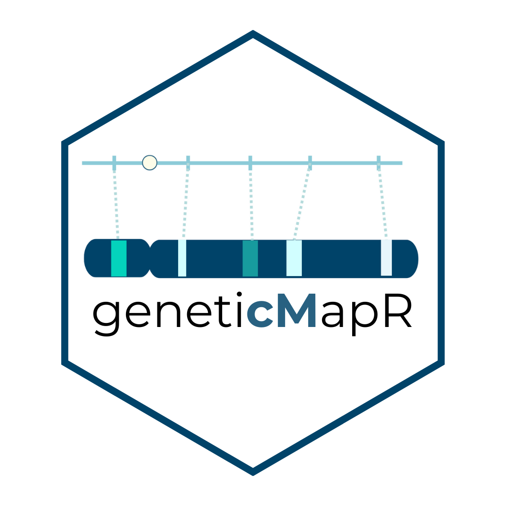

<!-- README.md is generated from README.Rmd. Please edit that file -->

```{r, include = FALSE}
knitr::opts_chunk$set(
  collapse = TRUE,
  comment = "#>",
  fig.path = "man/figures/README-",
  out.width = "100%"
)
```

# {geneticMapper} 

<!-- badges: start -->

<!-- badges: end -->

`geneticMapper` simplifies the construction of genetic maps. Built on top of [MapRtools](https://github.com/jendelman/MapRtools) and [R/qtl](https://rqtl.org/) for reproducible analysis. Optimized for F2 diploid plant populations. Some functions were generalized for different experimental populations and **polyploids**. `geneticMapper` was designed to help with reproducible genetic map construction and quantitative trait loci (QTL) analysis.

## Installation

You can install the development version of `geneticMapper` from [GitHub](https://github.com/) with:

```{r, eval=FALSE}
# Get devtools if needed
if (!requireNamespace("devtools", quietly = TRUE)) {
  install.packages("devtools")
}

#Install geneticMapper
devtools::install_github("vegaalfaro/geneticMapper")

# Load library
library(geneticMapper)
```

## Usage

The example shows how to *recode* markers when neither parent is the reference genome, as is common with [GBS](https://en.wikipedia.org/wiki/Genotyping_by_sequencing) data. Molecular markers (SNPs) must be phased to accurately trace allele inheritance in the progeny. `recode` is a general function that can help with that:

#### Recode

```{r example}
# Load the example dataset
data("simulated_geno")

# Check markers previous to recoding
print(simulated_geno)

# Recode the markers using the recode() function
phased <- geneticMapper::recode(simulated_geno, parent1 = "Parent1", parent2 = "Parent2")

# Print the output
print(phased)

```

#### Visualization

This function generates a QTL trace plot to visualize significance scores across chromosomes for one or more traits. It highlights QTL peaks and overlays customizable vertical lines

```{r, echo=TRUE, fig.width=8, fig.height=5, dpi=300}

library(geneticMapper)
data("qtl_example")

     plot_qtl_trace(qtl_df = qtl_example$qtl_df,
                thresholds_df = qtl_example$thresholds,
                  vline_df = qtl_example$vline,
                  use_physical_pos = FALSE,
                  x_angle = 0,
                trait_colors = qtl_example$colors,
                trait_labels = qtl_example$labels,
                plot_title = "Population 1")
```

## Documentation

For detailed documentation and examples, visit [geneticMapper](https://vegaalfaro.github.io/geneticMapper/reference/index.html)

### Logo 
credit: Adriana Lopez <3
