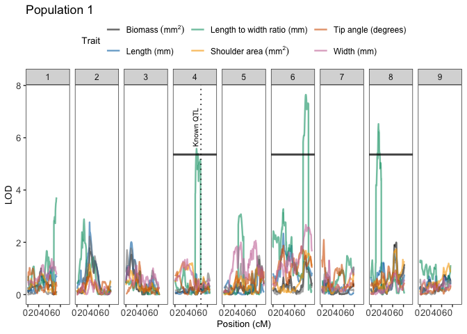

<!-- README.md is generated from README.Rmd. Please edit that file -->

# geneticMapR 

<!-- badges: start -->
<!-- badges: end -->

`geneticMapR` simplifies the construction of genetic maps. Built on top
of [MapRtools](https://github.com/jendelman/MapRtools) and
[R/qtl](https://rqtl.org/) for reproducible analysis. Optimized for F2
diploid plant populations. Some functions were generalized for different
experimental populations and **polyploids**. `geneticMapR` was designed
to help with reproducible genetic map construction and quantitative
trait loci (QTL) analysis.

## Installation

You can install the development version of `geneticMapR` from
[GitHub](https://github.com/) with:

``` r
# Get devtools if needed
if (!requireNamespace("devtools", quietly = TRUE)) {
  install.packages("devtools")
}

#Install geneticMapR
devtools::install_github("vegaalfaro/geneticMapR")

# Load library
library(geneticMapR)
```

## Usage

The example shows how to *recode* markers when neither parent is the
reference genome, as is common with
[GBS](https://en.wikipedia.org/wiki/Genotyping_by_sequencing) data.
Molecular markers (SNPs) must be phased to accurately trace allele
inheritance in the progeny. `recode` is a general function that can help
with that:

#### Recode

``` r
# Load the example dataset
data("simulated_geno")

# Check markers previous to recoding
print(simulated_geno)
#>         Parent1 Parent2 F2_1 F2_2 F2_3
#> Marker1       0       2    0    1    2
#> Marker2       2       0    2    0    1
#> Marker3       0       2    1    2    1
#> Marker4       2       0    2    0    0
#> Marker5       0       2    0    2    1
#> Marker6       2       0    2    0    0

# Recode the markers using the recode() function
phased <- geneticMapR::recode(simulated_geno, parent1 = "Parent1", parent2 = "Parent2")

# Print the output
print(phased)
#>         Parent1 Parent2 F2_1 F2_2 F2_3
#> Marker1       0       2    0    1    2
#> Marker2       0       2    0    2    1
#> Marker3       0       2    1    2    1
#> Marker4       0       2    0    2    2
#> Marker5       0       2    0    2    1
#> Marker6       0       2    0    2    2
```

#### Visualization

This function generates a QTL trace plot to visualize significance
scores across chromosomes for one or more traits. It highlights QTL
peaks and overlays customizable vertical lines

``` r

library(geneticMapR)
data("qtl_example")

     plot_qtl_trace(qtl_df = qtl_example$qtl_df,
                thresholds_df = qtl_example$thresholds,
                  vline_df = qtl_example$vline,
                  use_physical_pos = FALSE,
                  x_angle = 0,
                trait_colors = qtl_example$colors,
                trait_labels = qtl_example$labels,
                plot_title = "Population 1")
```



## Documentation

For detailed documentation and examples, visit
[geneticMapR](https://vegaalfaro.github.io/geneticMapR/reference/index.html)

### Hexlogo

Credit: Adriana Lopez
